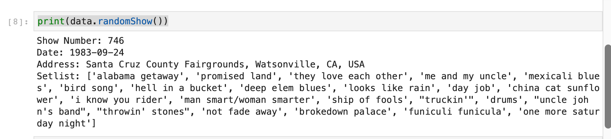
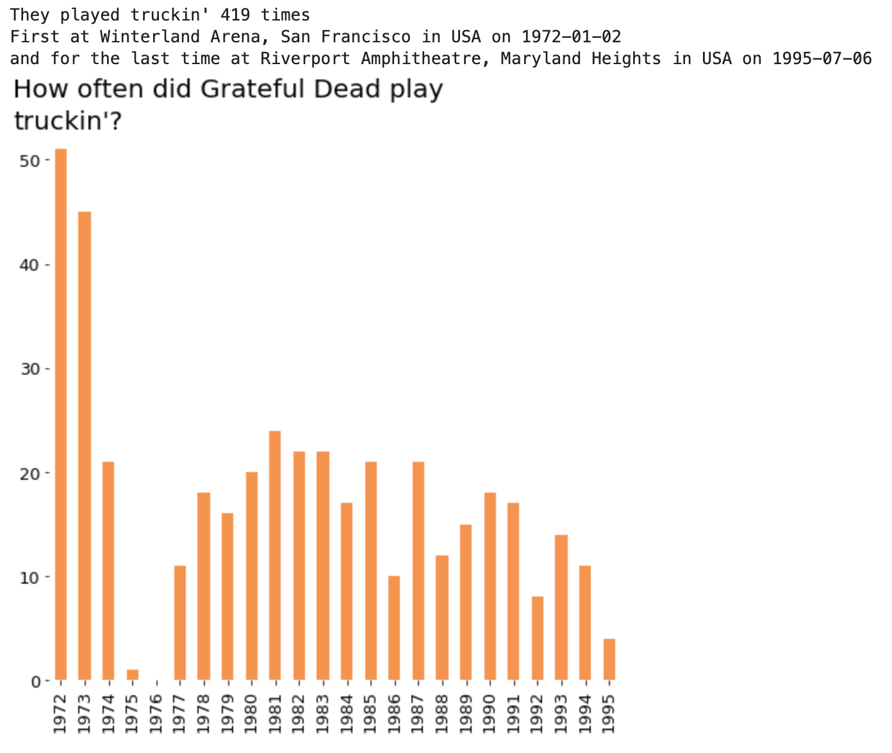

# jerryPycia

## What a long strange pip its been

jerryPycia is a python library that allows you to explore data related to the large number of live shows they performed. To aid this I have also created a ```.csv``` that documents their shows.

To install:

```pip install jerryPycia```

## Tutorial:

```
import jerrypycia as jPy
data, raw = jPy.grateful_loader()
```

The first of these objects has a few methods to allow you to quickly get some information from the dataset. The second is the raw data, in the form of a Pandas DataFrame. There are three methods you can use on ```data```. These are:

* .randomShow(). This is pretty self-explanatory. By doing ```print(data.randomShow())``` we will be given information about a random show. 



* .nextShow(). This iterates through the data. Every time you run ```print(data.nextShow())``` you will be given the next show.
* .song_search(). This allows you to investigate how often a particular song was played. If you try ```data.song_search("truckin'", plot=True)``` you should hopefully get the following:



## The Data

Finally, ```raw``` is a pandas dataframe of (almost) all of the Grateful Deads gigs. It is based on https://www.cs.cmu.edu/~mleone/gdead/setlists.html. This only includes dates from '72. I've ended up with around 1600 shows, meaning I'm about 800 short. Hopefully I'll find time to pick up the rest. Sadly, it's a time consuming process cleaning all the data so its the same shape. If theres any mistakes in the ```.csv``` I provided I will try my best to fix it.  


